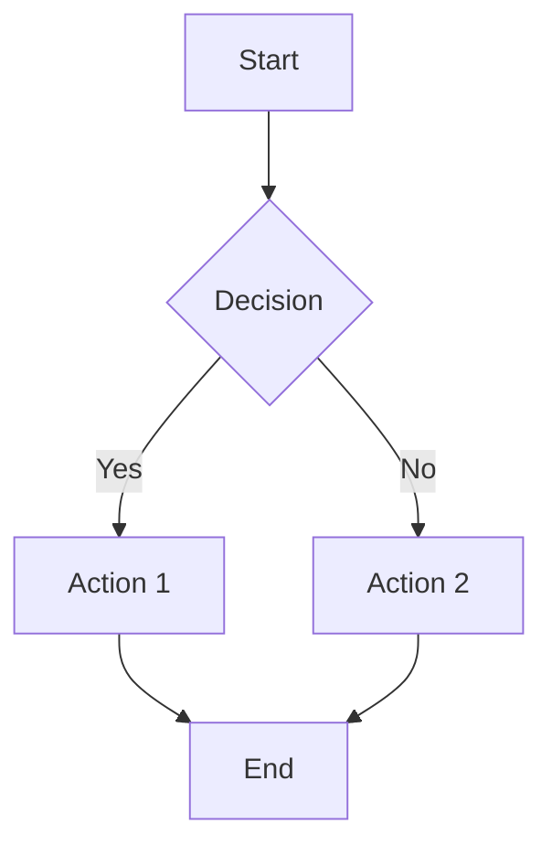
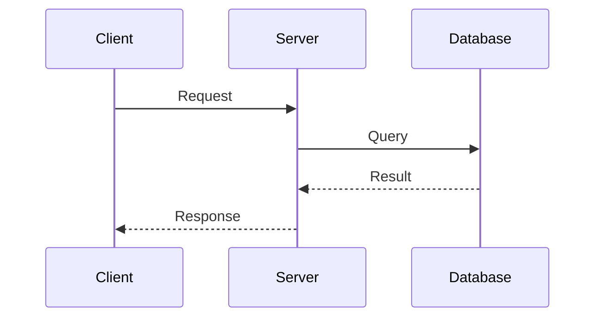
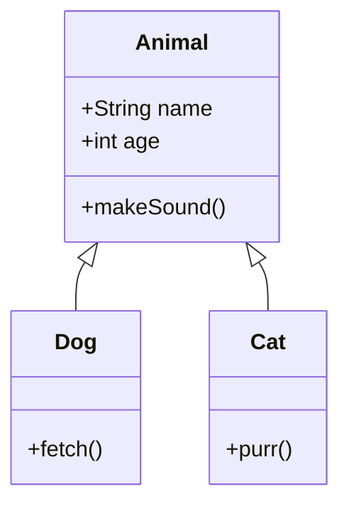
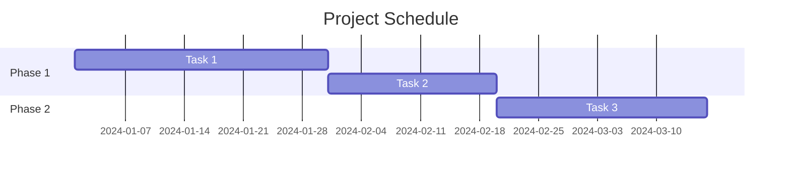

# Mermaid Diagram Syntax

## Flowchart

```mermaid
graph TD
    A[Start] --> B{Decision}
    B -->|Yes| C[Action 1]
    B -->|No| D[Action 2]
    C --> E[End]
    D --> E
```

## Sequence Diagram

```mermaid
sequenceDiagram
    participant Client
    participant Server
    participant Database
    
    Client->>Server: Request
    Server->>Database: Query
    Database-->>Server: Result
    Server-->>Client: Response
```

## Class Diagram

```mermaid
classDiagram
    class Animal {
        +String name
        +int age
        +makeSound()
    }
    class Dog {
        +fetch()
    }
    class Cat {
        +purr()
    }
    Animal <|-- Dog
    Animal <|-- Cat
```

## Gantt Chart

```mermaid
gantt
    title Project Schedule
    dateFormat  YYYY-MM-DD
    section Phase 1
    Task 1           :a1, 2024-01-01, 30d
    Task 2           :a2, after a1, 20d
    section Phase 2
    Task 3           :b1, 2024-02-20, 25d
```
