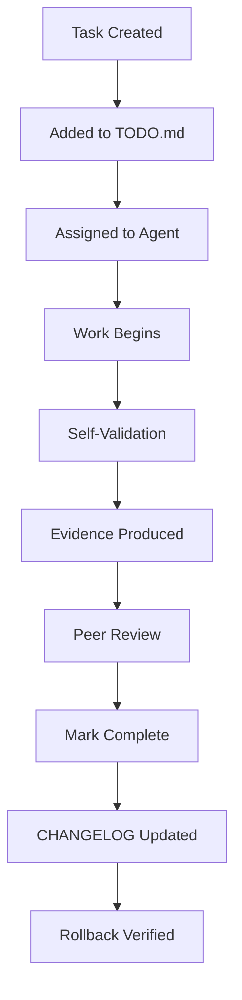

# Task Validation Protocol

## Table of Contents

- [Overview](#overview)
- [Todo File Format](#todo-file-format)
- [Task Lifecycle](#task-lifecycle)
- [Validation Rules](#validation-rules)
- [Evidence Requirements](#evidence-requirements)
- [Strict vs Lenient Mode](#strict-vs-lenient-mode)

## Overview

The Todo Validation Protocol enforces **todo-driven development** - no work begins without a tracked task, and no task is complete without validation evidence. This ensures accountability, traceability, and quality.

## Task File Format

### `TODO`.md Structure

```markdown
# TODO - project-name

## Active Tasks

| ID | Task | Phase | Status | Assigned | Created | Validated |
|----|------|-------|--------|----------|---------|-----------|
| 1 | Enterprise workspace initialization | setup | ✅ Done | system | 2026-01-15T10:00:00 | 2026-01-15T10:30:00 |
| 2 | Security hardening | security | ⏳ Pending | titan-agent | 2026-01-15T10:30:00 | |

## Phase: Setup

- [x] Create modular directory structure
- [x] Apply enterprise .gitignore
- [x] Initialize CHANGELOG.md
- [x] Create README.md with all sections
- [x] Set up .secrets/ with 700 perms

## Phase: Security

- [ ] Configure .secrets/ per role
- [ ] Rotate API keys
- [ ] Verify gitignore compliance
- [ ] Test rollback capability

## Completion Rules

1. **No task marked complete without validation evidence**
2. **Validation = artifact produced (log, report, test result, screenshot)**
3. **Self-validation must pass before marking complete**
4. **Rollback verified for each phase**
5. **CHANGELOG.md updated with rationale on completion**
```

### Required Fields

| Field | Description | Format |
|-------|-------------|--------|
| ID | Unique task identifier | Integer, sequential |
| Task | Descriptive task name | Clear, specific |
| Phase | Logical grouping | setup, security, validation, operations |
| Status | Current state | ✅ Done, ⏳ Pending, 🔄 In Progress, ❌ Blocked |
| Assigned | Responsible agent | hermes, titan, avery, allman, system |
| Created | ISO timestamp | 2026-01-15T10:00:00 |
| Validated | ISO timestamp when verified | 2026-01-15T10:30:00 |

### Checkbox Format (Alternative)

```markdown
## Phase: Setup

- [x] Create modular directory structure
- [x] Apply enterprise .gitignore
- [ ] Configure role-specific settings
```

## Task Lifecycle



### State Transitions

| From | To | Trigger | Requirements |
|------|-----|---------|--------------|
| Created | Pending | Added to `TODO`.md | Phase assigned |
| Pending | In Progress | Agent starts work | None |
| In Progress | Done | Self-validation passes | Evidence artifact produced |
| In Progress | Blocked | Blocker identified | Blocker documented |
| Done | Validated | Peer review passes | Validation timestamp set |
| * | * | Rollback | Emergency only |

## Validation Rules

### Core Rules (Non-Negotiable)

1. **Every task must have a `TODO`.md entry before work begins**
2. **No task marked ✅ Done without validation timestamp**
3. **Validation timestamp must be ISO 8601 format**
4. **Evidence artifact must exist for each completion**
5. **CHANGELOG.md entry required for each phase completion**

### Strict Mode (Enabled by default for enterprise)

```bash
python3 scripts/task_validator.py --workspace /path --strict
```

**Strict checks:**
- Validation timestamp must not be empty/N/A/"pending"
- Evidence artifacts must exist in `logs/`
- Self-validation script must pass
- Rollback test must pass for phase

### Lenient Mode (Development only)

```bash
python3 scripts/task_validator.py --workspace /path
```

**Lenient checks:**
- `TODO`.md exists
- At least one active task
- Completed tasks have validation field (may be empty)

## Evidence Requirements

### Required Artifacts per Phase

| Phase | Evidence Artifacts | Location |
|-------|-------------------|----------|
| setup | Structure validation JSON | `logs/structure-validation.json` |
| security | Security audit JSON, gitignore check | `logs/security-audit.json` |
| validation | Task-validation JSON, stub scan | `logs/todo-validation.json` |
| operations | Self-validation JSON, rollback test | `logs/self-validation.json` |
| any | CHANGELOG entry | `CHANGELOG.md` |

### Artifact Format (JSON)

```json
{
  "operation": "validate_structure",
  "timestamp": "2026-01-15T10:30:00.123456",
  "status": "success",
  "skill_name": "enterprise-organization",
  "details": {
    "workspace": "/path/to/workspace",
    "role": "hermes",
    "missing_dirs": [],
    "fixed": ["Created: plugins", "Fixed .secrets permissions to 700"],
    "valid": true
  },
  "cost": {"tier": 0, "amount_usd": 0.0, "service": "local"}
}
```

### Validation Flow

```bash
# 1. Agent creates task in TODO.md
# 2. Agent does work
# 3. Agent runs validation script
python3 scripts/validate_structure.py --workspace . --json > logs/structure-validation.json

# 4. Check result
python3 -c "import json; d=json.load(open('logs/structure-validation.json')); print(d['details']['valid'])"

# 5. If valid, mark task complete in TODO.md with timestamp
# 6. Add CHANGELOG entry
python3 scripts/changelog_manager.py --add --phase "setup" --author "hermes" --reason "Structure validated" --method "validate_structure.py" --validation "structure-validation.json: valid=true"
```

## Integration with Other Tools

### With CHANGELOG Manager

```bash
# When phase completes, auto-create CHANGELOG entry
python3 scripts/changelog_manager.py --workspace . --action add \
  --phase "security" \
  --author "titan-agent" \
  --reason "Security hardening complete" \
  --method "security_hardening.py --fix" \
  --validation "security-audit.json: valid=true, 0 issues"
```

### With Self-Validator

```bash
# Validate todo completion includes self-validation
python3 scripts/self_validator.py --workspace . --json > logs/self-validation.json
```

### With CI/CD

```yaml
# .github/workflows/todo-validation.yml
- name: Validate Todos
  run: |
    python3 scripts/task_validator.py --workspace . --strict --json > logs/todo-validation.json
    python3 -c "import json, sys; d=json.load(open('logs/todo-validation.json')); sys.exit(0 if d['details']['valid'] else 1)"
```

## Troubleshooting

### Common Failures

| Error | Cause | Resolution |
|-------|-------|------------|
| "`TODO`.md not found" | Missing tracking file | Run `enterprise-org.py init` or create manually |
| "Task marked complete but no validation timestamp" | Forgot to update Validated column | Add ISO timestamp to Validated field |
| "No active tasks found" | All tasks done or none created | Add new tasks for next phase |
| "Evidence artifact missing" | Validation not run or not saved | Run validation script with --json output |

### Recovery

```bash
# Quick TODO.md template
cat > TODO.md << 'EOF'
# TODO - recovery

## Active Tasks

| ID | Task | Phase | Status | Assigned | Created | Validated |
|----|------|-------|--------|----------|---------|-----------|
| 1 | Restore TODO.md tracking | recovery | ⏳ Pending | system | $(date -Iseconds) | |

## Phase: Recovery

- [ ] Restore TODO.md tracking
- [ ] Re-validate completed work
- [ ] Update CHANGELOG.md
EOF
```

## Compliance

**Enterprise Requirements:**
- ✅ `TODO`.md exists at workspace root
- ✅ At least one active task always present
- ✅ Every completed task has validation timestamp
- ✅ Evidence artifacts in `logs/`
- ✅ CHANGELOG.md updated per phase
- ✅ Self-validation passes
- ✅ Rollback verified per phase

**Audit Command:**
```bash
python3 scripts/task_validator.py --workspace . --strict --json
```